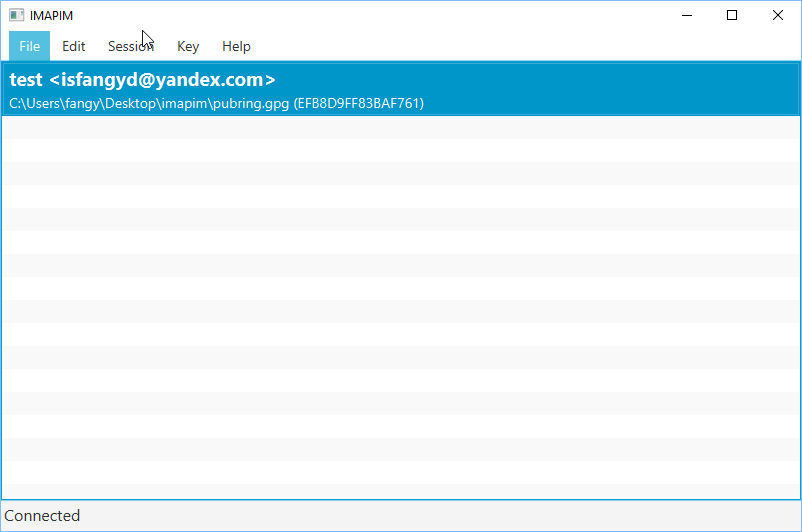
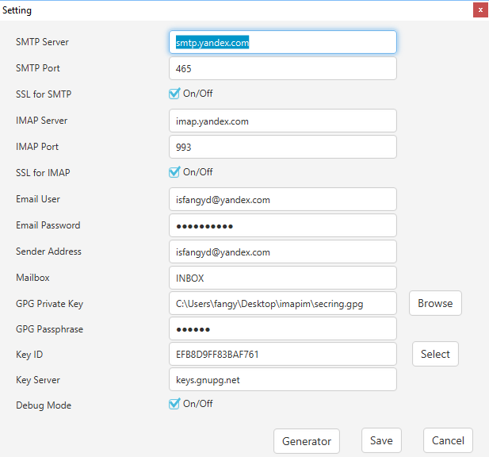
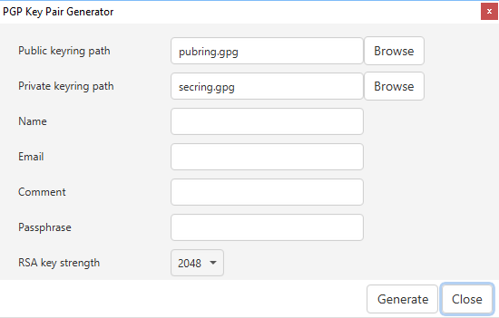
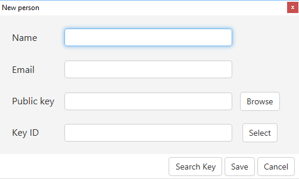
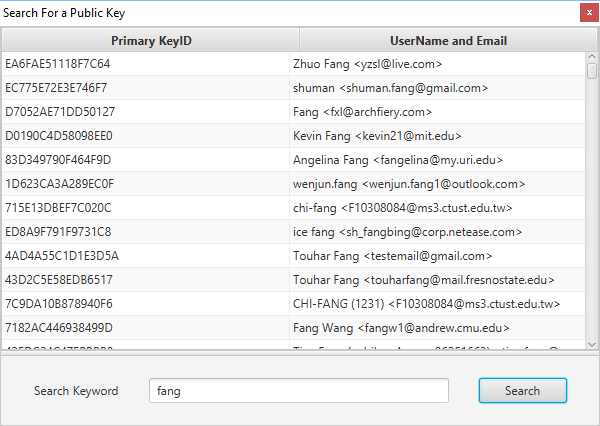
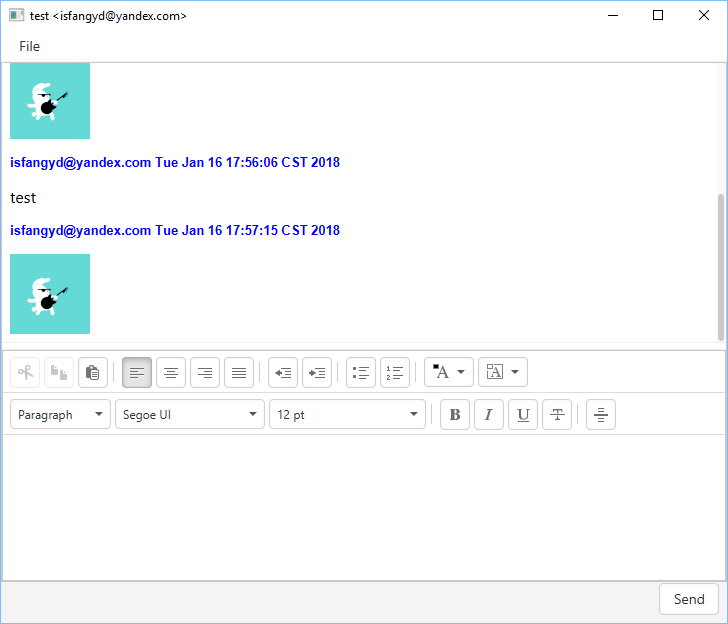

# Computer Network (CS305) Project - IMAPIM

An instant message JAVA application based on IMAP protocol and GPG encryption.

## Screenshots

main window:

Setting

Key Generator

Add contact

Search For contact on public key server

Chat window

## Application Features

 - Fully Featured GUI
 - Contact list and management
    - `Add/Edit` contact from public key file or public key server
    - `Search` a public key on a `key server`
 - `Upload` the public keys configured in the setting
 - Setting and contact list encryption
 - Single person chat
    - HTML supported
    - Image supported
 - GPG Key Generator

## Usage

1. Start up the application, and then set your configuration file encryption password.
2. Generate a pair GPG Key be careful with the location of your private key.
3. (Optional) Upload your public key so that your friend can get it easily.
4. Set your email server (including `SMTP` server and `IMAP` server) and account information so that the email system can work properly.
5. Exchange your public key with your friends.
6. Add your friends public key and email address to the account list.
7. Start chatting!

## Know Issues

- Slow for message updating
- Blocking while searching for the key
